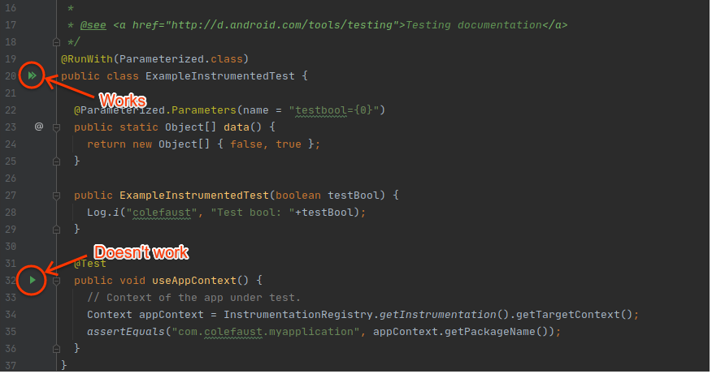

# Parameterized test reproduction

When using Parameterized tests with `androidx.test.runner.AndroidJUnitRunner`,
android studio / `adb shell am instrument` will be unable to run an individual
test class.

To repro, open this folder in Android Studio, navicate to
ExampleInstrumentedTest, and try clicking the green arrow next to the
test method.
